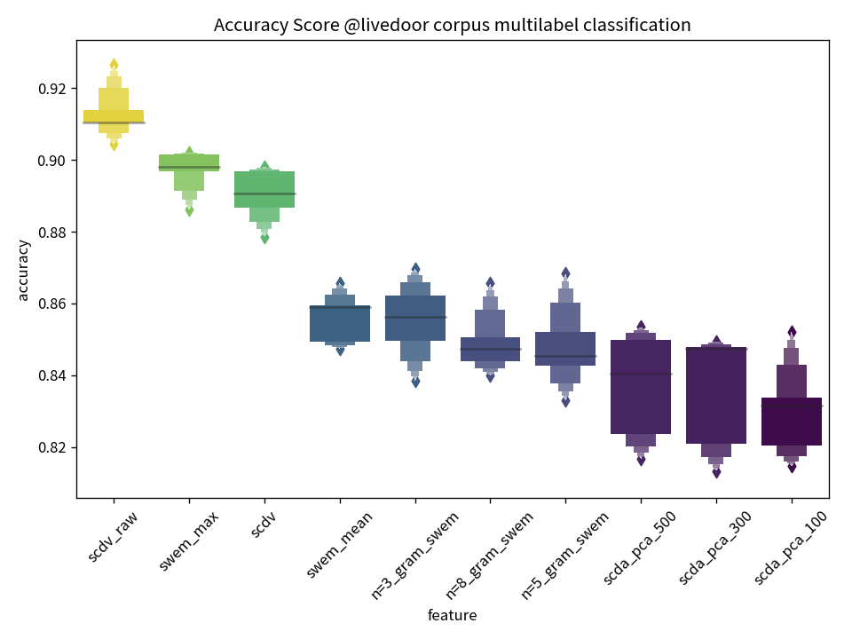

# SCDV Python

Sparse Composite Document Vectors python Implementation

## Requirements

In my Dockerfile, use `python==3.5.2`

```bash
penguin@37ef290e8e58:/working$ python -V
Python 3.5.2 :: Continuum Analytics, Inc.
```

and following libraries

```console
jupyter
notebook
tqdm
matplotlib
numpy
scipy
scikit-learn
pandas
seaborn
lightgbm
joblib
# NLP Tools
mecab-python3
gensim
```

## Setup

### Recommended

```bash
cp project.env .env
docker-compose build

docker-compose up -d

docker exec -it scdv-jupyter bash
# or access to localhost:7001
```

### note

jupyter's default password is written on Dockerfile arg.
The default is `"dolphin"`.

### Trouble Shooting

If you catch error as below

```bash
ERROR: for scdv-jupyter  Cannot start service jupyter: driver failed programming external connectivity on endpoint scdv-jupyter 
(a16e504598f6081390b47fe6809aaba1a8b52672956e65feb11d3c00773363ba): Bind for 0.0.0.0:7011 failed: port is already allocated
```

, change .env `JUPYTER_PORT` number.

## Create SCDV

Create SCDV feature using [livedoor corpus](https://www.rondhuit.com/download/ldcc-20140209.tar.gz).

```bash
$ python src/train.py -h
usage: train.py [-h] [-c COMPONENTS]

optional arguments:
  -h, --help            show this help message and exit
  -c COMPONENTS, --components COMPONENTS
                        GMM component size (i.e. latent space size.) (default:
                        60))
```

## BenchMark

Multilabel classfilication task using livedoor corpus.

```bash
python src/SCDV_vs_SWEM.py
```

### Sample Result

#### Settings

* embedding model: pretrained fasttext [https://qiita.com/Hironsan/items/513b9f93752ecee9e670](https://qiita.com/Hironsan/items/513b9f93752ecee9e670)
  * Embedding dim: 300
* Gaussian Mixture Clusters: 60
* Features
  * SCDV
  * SCDV without compress
  * Compressed SCDV by PCA (compressed dim = 100, 300, 500)
  * SWEM
    * ([Simple Word Embedding Model](https://arxiv.org/abs/1805.09843) proposed in https://arxiv.org/abs/1805.09843. max-pooling and average-pooling)
  * n-gram SWEM (n = 3, 5, 8)
* Classification Model: LightGBM
  * same parameters for all features



* SCDV (not comporessed) work well
  * computation cost: SWEM << SCDV (calculate Gaussian Mixture)
  * Accuracy: SWEM < SCDV

## Similarity Search

The query document index is `500`

    query label: sports-watch
    宮本恒靖氏、U-23日本代表に「リスクを冒さないとダメ」
    11日、国立競技場では、ロンドン五輪壮行試合＝キリンチャレンジカップ2012・U-23日本代表×U-23ニュージーランド代表の一戦が行われた。

    試合は、後半26分、徳永悠平が放ったミドルシュートを相手キーパー・グリーソンが弾いたところで杉本健勇がこぼれ球をゴールに蹴り込み、先制点を挙げる。だが、後半もロスタイムに入ると、日本はイージーミス

* How
  * compute euclide distance for all sentence vectors (SCDV) and sort, chick up top 20.

### Result(Top20)

|     | labels       | headline                                                                           | distance |
|-----|--------------|------------------------------------------------------------------------------------|----------|
| 500 | sports-watch | 宮本恒靖氏、U-23日本代表に「リスクを冒さないとダメ」                               | 0.000000 |
| 461 | sports-watch | U-23日本代表、まさかのドロー。セルジオ氏は「まるで高校サッカーの決勝」             | 0.659019 |
| 263 | sports-watch | ″ご立腹″の松木氏、関塚監督の采配について苦言呈す                                   | 0.723584 |
| 39  | sports-watch | 【Sports Watch】日本代表、格下相手に引き分けも「収穫はあった」とキッパリ           | 0.765263 |
| 181 | sports-watch | 加藤浩次、不可解レフェリーに怒り心頭 「あんな笛見たことない」                      | 0.791522 |
| 851 | sports-watch | “日本の心臓”遠藤保仁の凄すぎるプレー、日本を救った1本のパスとは？                  | 0.795824 |
| 22  | sports-watch | 日本がロンドン五輪出場。澤登正朗がオーバーエイジ枠に推したのは？                   | 0.806352 |
| 784 | sports-watch | 【Sports Watch】試合から半月、対戦した吉田とテセが激闘の裏側を語る                 | 0.809508 |
| 794 | sports-watch | U-23日本代表快勝も、セルジオ越後氏「ロンドン五輪に行ったら恥をかくだけ」           | 0.817949 |
| 676 | sports-watch | 清水エスパルス、ラフプレー連発の韓国チームとの試合打ち切り                         | 0.818147 |
| 522 | sports-watch | 【Sports Watch】李がなでしこ・丸山をダメ出し 「まだできる余地がある」              | 0.822058 |
| 7   | sports-watch | 【Sports Watch】セルジオ氏がバッサリ「全く収穫がない」                             | 0.823967 |
| 137 | sports-watch | 「全く信頼されていない」韓国代表FWに批判の声                                       | 0.824535 |
| 164 | sports-watch | 【Sports Watch】日本代表、無得点ドローも「うまくいかなかった前半にポイントがある」 | 0.825946 |
| 606 | sports-watch | あの中村俊輔すらも「和風メッシだ」と驚く新星、齋藤学                               | 0.826273 |
| 67  | sports-watch | 【Sports Watch】本田圭佑「個人的には不本意なプレーだった」                         | 0.826696 |
| 437 | sports-watch | U-23日本代表、準決勝に散る。釜本氏は「メキシコは試合巧者」                         | 0.827814 |
| 345 | sports-watch | 【Sports Watch】日本と激突!?　驚愕テクニックを持つ“女ジダン”                       | 0.832334 |
| 723 | sports-watch | 日本代表ホームで完敗、北澤豪氏は「かなり危険な状態」                               | 0.833288 |
| 462 | sports-watch | “完勝”日本代表にも、北澤氏は「これ普通なんです」                                   | 0.833421 |
